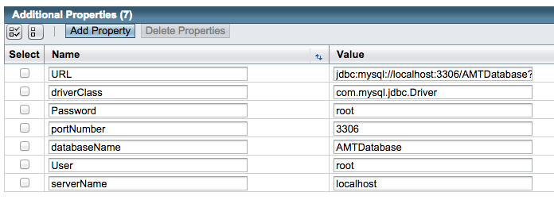
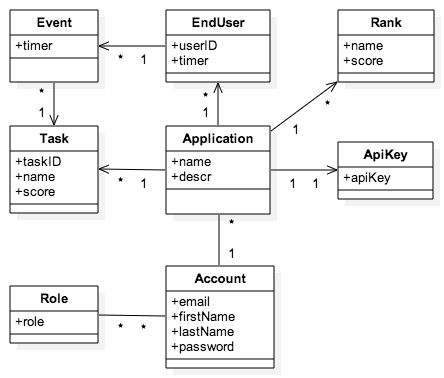
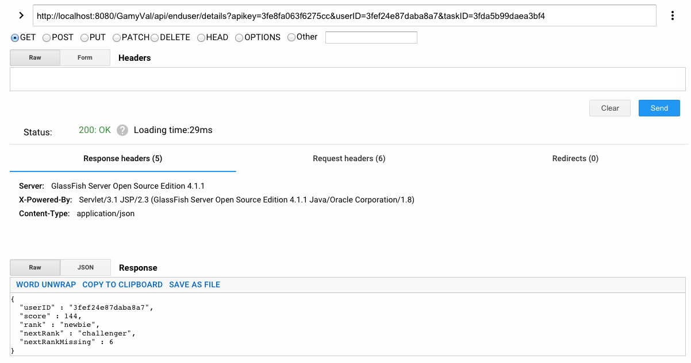
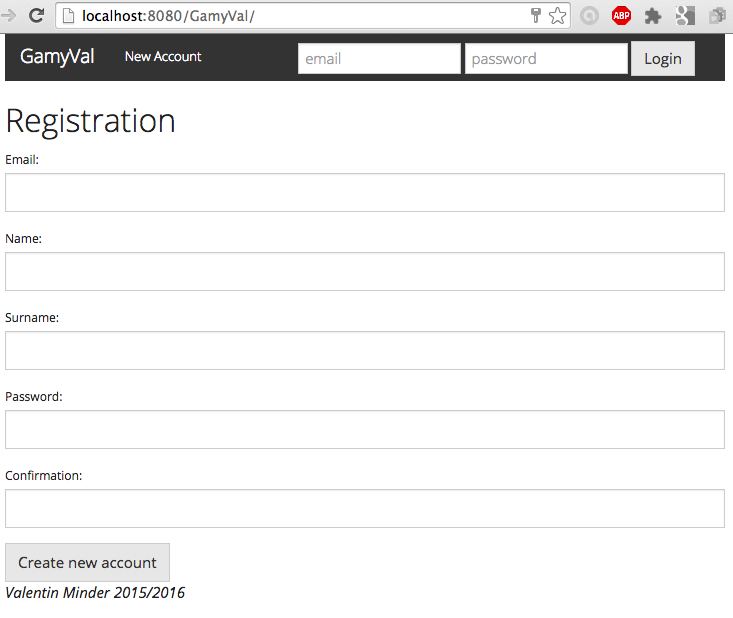
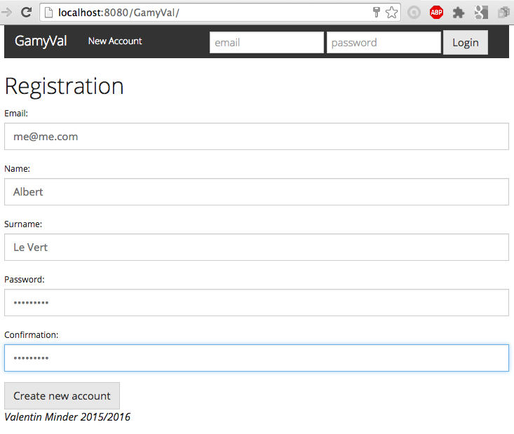
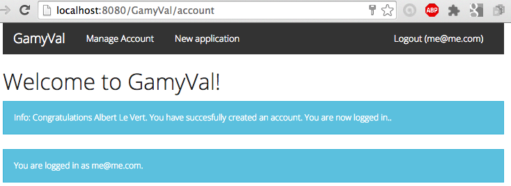
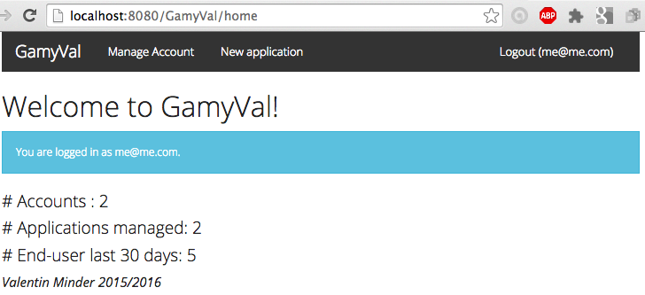
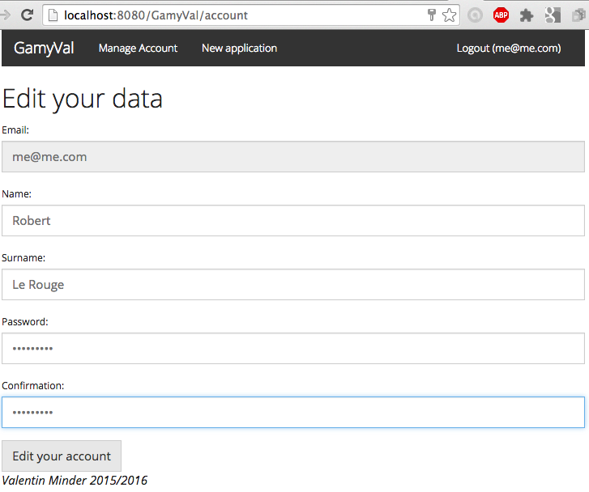
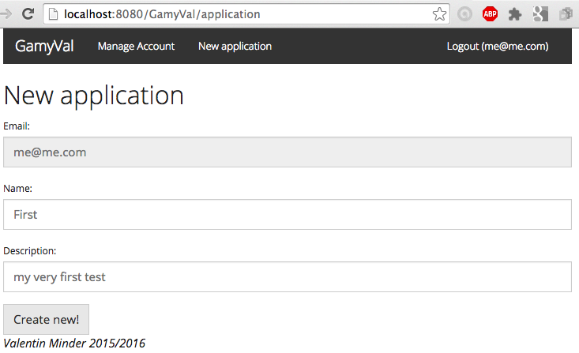
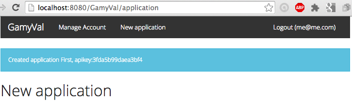

#Project Report : AMT - GamyVal

## Administrative information

### Team


Last name, first name | Github ID   | Main role in the project
----------------------|-------------|---
Minder, Valentin  | [ValentinMinder](https://github.com/ValentinMinder) | "everything"


### Tasks realized by the different team members

Not relevant (solo project).


## Introduction

This document is a description of the work done in the AMT project about Gamification, using Java EE technologies, following by distance the AMT class (multi-tiers applications) from HEIG with Mr. Liechti, in 2015/2016.


## User Guide

### Environment
The project assumes you have a working environement, with minimal config:

- database access (tested with mysql 5.5.33)
- optionnally, a phpMyAdmin access (tested with Mamp and phpMyAdmin 4.0)
- glassfish server (4.1, tested with 4.1.1)
- Java EE (v.7)
- an IDE to launch and deploy (Netbeans 8.0 complete edition, tested with 8.1)
- a browser (tested with Chrome 48.0)
- a Http client capable of sending and recieving custom http request and response to test the REST api (tested with [Advanced REST client](https://chrome.google.com/webstore/detail/advanced-rest-client/hgmloofddffdnphfgcellkdfbfbjeloo), a Chrome extension)

The connection to the datasource (`jdbc/GamYDS` to define in glassfish, within `mysql_GamY_rootPool` connection Pool) is assuming the mysql default configuration.

- datasource: `jdbc/GamYDS`
- user: `root`
- password: `root`
- port: `3306`
- database: `AMTDatabase`
- url: 


```
jdbc:mysql://localhost:3306/AMTDatabase?zeroDateTimeBehavior=convertToNull
```
Configuration in glassfish properties:
[localhost:4848/common/index.jsf](localhost:4848/common/index.jsf)


###Fixing glassfish 4.1.1

If you have updated glassfish from 4.1 to 4.1.1 (or you just reinstalled the tools), working with glassfish 4.1.1 _you MAY encounter this error_ when using some of the Webservices, like the Rest Api or other functions.

```
StandardWrapperValve[javax.ws.rs.core.Application]: Servlet.service() for servlet javax.ws.rs.core.Application threw exception
java.lang.NoClassDefFoundError: Could not initialize class org.eclipse.persistence.jaxb.BeanValidationHelper
```

Make sure glassfish is stopped and fix it the way it is suggested here (it's a _'dirty'_ hack but it works).
[https://java.net/jira/browse/GLASSFISH-21440](https://java.net/jira/browse/GLASSFISH-21440?focusedCommentId=390331&page=com.atlassian.jira.plugin.system.issuetabpanels:comment-tabpanel#comment-390331)


- Identify where glassfish is installed on your system (example is given on MacOSX)

```
cd /Applications/NetBeans/glassfish-4.1.1/glassfish/modules/
```

- unjar the `org.eclipse.persistence.moxy.jar` file

```
jar xf org.eclipse.persistence.moxy.jar
```

- open the `META-INF/MANIFEST.MF` file (use any editor that you like: vi, nano, gedit, ...)

```
gedit org.eclipse.persistence.moxy/META-INF/MANIFEST.MF
```
- search for `Import-package :` and add the following at the end of it (it should end with `org.xml.sax;resolution:=optional`)
 
```
,org.xml.sax.helpers,javax.xml.parsers;resolution:=optional,javax.naming;resolution:=optional
```

- jar back the `org.eclipse.persistence.moxy.jar` file

```
jar cvf org.eclipse.persistence.moxy.jar org.eclipse.persistence.moxy
```

- restart glassfish 4.1.1 and enjoy the hack.

### How to execute and access the application

To execute the application, you may follow these steps:

- make sure you have a running mysql server
- in glassfish, make sure you have configured the datasource 
- Open Netbeans (it was tested with this IDE but nothing is against another one)
- click open existing project
- search for the the pom.xml, it imports the project
- if necessary, click clean & build
- click run: the application should be deployed (it will run glassfish if it was not running before)

To access the application, mainly the user the User UI Interface, open any browser and point to the following address. 

[http://localhost:8080/GamyVal](http://localhost:8080/GamyVal)

The usage of the UI should be intuitive. See the design section for more details.

### How to use the application

The application is divided into 2 parts

- the user UI, accessible from any browser
- the REST api for third-party developpers

The usage of the UI should be quite intuitive. It allows the following operations:

- account creation & modification
- login & logout
- see the stats of the service (number of accounts, number of applications, number of end user created)
- launch of a new app 

Rules for password creation and modification:

- at least 10 characters
- at least one lower case letter (`a-z`)
- at least one upper case letter (`A-Z`)
- at least one digit (`0-9`)
- at least one other character, that is not of the previous categories (ponctuation `:.-!`, symbols `$£§°&#`, diacritiques `àéèê`, etc) 

The REST api allows developpers of third-party app to send requests to the application using Http request and replies, with JSON objects when applicable. It is accessible at the following URL, where entrypoint correspond to the REST function exposed. See the design section for more details.

[http://localhost:8080/GamyVal/api/v1/entrypoint](http://localhost:8080/GamyVal/api/v1/entrypoint)

`v1` stands for the version 1. If you should deploy a new version of the API, you will deploy it on `v2` and still support requests to the old API for a while, giving time to your clients to upgrade.

### How to update, build and deploy the application

In your IDE (like Netbeans), modify your code, hit clean and build, hit run, and the application is deployed in glassfish, automatically.

### How to run the automated test procedure

Not relevant in this context.

## Design

### System overview

The first part, including Role, Account, ApiKey, Application and EndUser was strongly suggested by the specifications. The following is then defined by the author.

In the context of their app, the developpers will define Tasks. A task might be "_upvoting_" and worth 1 point, or "_answering a question_" and worth 5 points.

Then, every time a enduser performs one of these task, it's a new Event: a particular user for a particular task.

The ranks are then defined for every application based on the number of points acquired.



### Gamification feature

The gamification was developped arround _RANK_. 

Rank is based solely on score (number of points acquired through tasks). Each rank is defined with a certain level of points. Every user then has the rank that is immediately lower than its score. 

An example could be Rank: Newbie with 10 points, Rank: Challenger with 100 points, Rank: Expert with 1000 points. A user with 13 points would be of rank Newbie, and the next step for him would be rank Challenger, but he is still missing 87 points to reach the next rank.

Finally, the user can retrieve its score, current rank, the next rank to reach and the number of points missing to reach the next rank.

### User interface

The UI allows the admin of an app to create an account (register), login and logout, modify the details of the account and create new application. 

When logged in, we can see the stats of the system (number of accounts, number of application and number of end-user created the last 30 days).


### REST API

Every request is to be prefixed by 

```
http://localhost:8080/GamyVal/api/v1
```
And this header when their is provided content (post and put)

```
Content-Type: application/json
```

#### Entry points

```
/account
/application
/enduser
/event
/rank
/task 
```

#### Full REST API on /application

A full Api may provide:

- GET and POST on the collection (/application). GET returns the whole collection while POST create a new element in the collection.
- GET, PUT and DELETE on the elements (/application/id). GET retrieve the element, PUT updates all (some of) the fields, while DELETE removes the element. 

The REST API on /application provides the whole set of CRUD operation to demonstrate its usage.

- creation of a new app (post, the whole item including the apikey is sent back)

```
POST /application
{ "email":"me@me.com", "name":"New App", "descr":"new"}
```

- retrieve the list of apps (get)

```
GET /application
```
- edition of an existing app (put)

```
PUT /application/apikey
{ "name":"FirstApp", "descr	":"yes"}
```
- deletion of an existing app (delete)

```
DELETE /application/apikey
```
- retrieve the details of a single app (get)

```
GET /application/apikey
```

#### The "rest" of the API ;)
The other entry points dont offer all of the functions, only those useful to demonstrate the usage of the app.

- retrieve the list of accounts (without the passwords with the help of DTO)

```
GET /account
```

- retrieve the list of accounts (with the passwords without the help of DTO, to demonstrate possible security issues about private data leakage)

```
GET /account/insecure
```
- creation of end-user (and it returns the enduser entity with userID, that should be kept by dev for future use)

```
POST /enduser?apikey={apikey}
```
- see the end-users, without the need of the api key (/!\ all the details & all the apps: this is demonstration of a security issue about api usage authentication !)

```
GET /enduser
```
- creation of task (it returns the task entity with its taskID)

```
POST /task?apikey={apikey}
{ "name":"question", "score":12 }
```

- simulation of events: end-user does a task (returns nothing)

```
POST /event?apikey={apikey}&userID={userID}&taskID={taskID}
```
- creation of ranks

```
POST /rank?apikey={apikey}
{ "name":"newbie", "score":10}
```

- see all the ranks (unordered)

```
GET /rank?apikey={apikey}
```

- see all the ranks (ORDERED, to demonstrate named query usage)

```
GET /rank/ordered?apikey={apikey}
```

- demonstration of the state of the enduser

```
GET /enduser/details?apikey={apikey}&userID={userID}
```

- answer for the details of the end user

```
{
  "userID" : "3fef24e87daba8a7",
  "score" : 10,
  "rank" : "newbie",
  "nextRank" : "master",
  "nextRankMissing" : 25
}
```



### Design patterns

MVC for the web pages (jsp pages - Servlet).

DAO for the Entity - DTO - Rest Resource.


## Implementation

### Package structure

	src.javach.heigvd.amt.gamyval -> entry point
	|models.entities -> entity (java pojo)
	|restapi. -> REST content
	        |dtos -> DTO  (Data transfer object)
	        |ressources -> REST services
	|service.daos -> DAO and local DAO interface (data access object)
	|webapp. -> web pages controllers
	       |controllers -> Servlet, entry point for web services and pages
	       |filters -> Servlet used for authentification verification

Jsp Web pages

	web. -> web pages
	   |index.jsp -> index page
	   |static -> js and css style documents
	   |WEB-INF. -> protected content
	           |web.xml -> description of servelt available and path
	           |pages -> all the jsp pages (views)

### Structure of the code

For every Entity of the UML was defined a Jpa Entity for persistante, which was simples pojo's, with Java EE annotation for associations.

Then most of them turn into DAO (with their interface DAOLocal), at least all those who needed to be created by the API (call to `create`) or who provide business method (like Rank provides `findAllOrdered` and `findGreaterRank`).

The most used ones were also turned into one or several DTO's, either for creation or for transmission (see next section for details).

Finally services were provided for certain entities, to perform some or all of the CRUD operation (Create, Read, Update, Delete). See the REST API section for details.

### Selected aspects

#### DTO over Entity

Some of the Entities were turned into DTO's, for the following goals.

- creation of Entity: when the dev creates an entity with the Rest Api, they might not know some of the fields that are specific to our implementation. An example mighe be the TaskNewDTO: the dev provides a name and points, but cannot provide the taskID that will be created by the app. Therefore a real Entity cannot be constructed yet. So the dev data will arrive in a DTO that contains the data provided by the dev, and the app will create the real Entity based on the DTO and generated data.

- transmission of light-weight data: it does not copy the whole hierarchy but only the part that you choose. In case of an application, you dont want the whole structure of enduser and ranks to be replicated. This is used in ApplicationSummaryDTO: a real application consist of a list of Rank, a list of Task, etc. But we are just interested in the name and the apikey, so we created a DTO to send reduced data.
 
- transmission of secured and limited data: it can help to protect sensitive data that are contained in the Entity that should never be sent. This is used in AccountSummaryDTO: only names and email are sent, without the password. If we would send the Account object, we would send the password credentials with it, which is a huge security flaw.

- transmission of computed data: sometimes you want to send some aggregated or processed data. So you will perform a few computations and then send the results. This is used in EndUserSummaryDTO to send the score, the rank, the next rank and the missing points to the next rank. All these data are not stored but computed every time an end user ask for the statistics about his account.

- sometimes it looks just "useless": the RankDTO is exactly the same as the Rank Entity. You might thought this is an error or a misunderstanding of the concept of DTO's and Entities. Much likely the code evolved and at the some point we needed a DTO, maybe because Rank Entity was containing some private or computed information, that has been removed afterwards.
 
## Demo

This is a short description of what is demonstrable.

On the UI:

- security filter of home page (the home page is not accessible)
- new account creation using the form
- password quality verification (confirmation, length, content)
- auto-login when sign-up
- login & log-out
- application details on home page
- account edition of name/password
- creation of new app within the UI

On the REST api: see the list of Rest Api description.

On the UI (with images)

- security filter of home page (the home page is not accessible)


- new account creation using the form


- auto-login when sign-up


- application details on home page


- account edition of name/password


- creation of new app within the UI


- creation of new app within the UI: success


## Testing and validation

Not relevant.

## Known Issues

### What's next ?

The following parts were not completed.

- part 1: continued UI for app management
	- change app details
	- to start, stop, delete apps
	- see users by app, and use pagination 
	- However, the core usage of the UI, the security features and the MVC separation were demonstrated.

- tests:
	- Extensive testing with classic Java Tests
	- automated user acceptance tests with Selenium 
	- performance and load testing with JMeter

- part 2: 
	- the REST api is not fully supported. All collections should support get and post, while all single items should support get, put and delete. 
	- The reply should be more clear if the request was successful, and if yes return the ID of the created item. 
	- It should also fails nicely when an error occurs (distinguish the different failures, and don't provide the client too much information).
	- It should support a better authentication and security feature to avoid leakage (see the rest api description for an example).
	- However, the core functionnalities were done and all of the CRUD operation were demonstrated at least once. 

- part 3: this part was not developped, it was out of scope of a solo project.
	- the api provided is very simple and allows a unique usage. A real api should be more flexible and adaptable to (almost) every client needs.
	

## Conclusion

As we can see the project was not finished completely but the part that was done proved most of the functionnalities and demonstrate the usage and comprehension of the subject.

While is working for the case it was thought, the project is not really modular for any real and complex gamification use for a real client. This is more like a proof-of-concept: at the end we can see the gamification working from end-to-end.

Doing this project alone and away from the lectures was a real challenge, both in terms of workload and knowledge. It wouldn't have been possible without reading a lot of documentation by myself and a lot of personnal work.